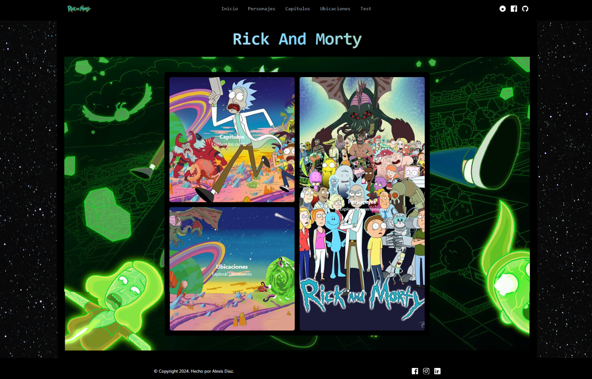
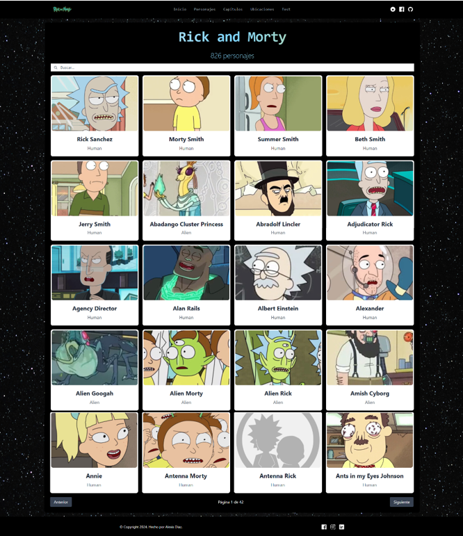
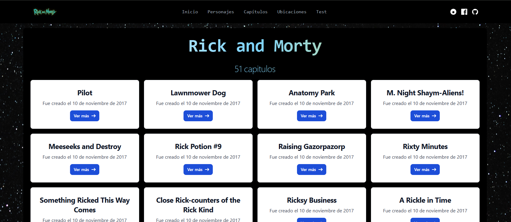
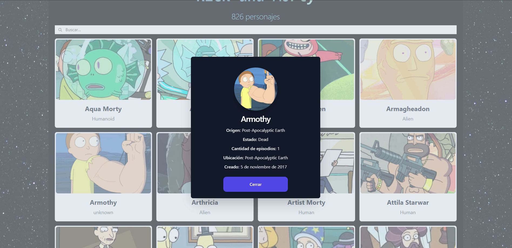
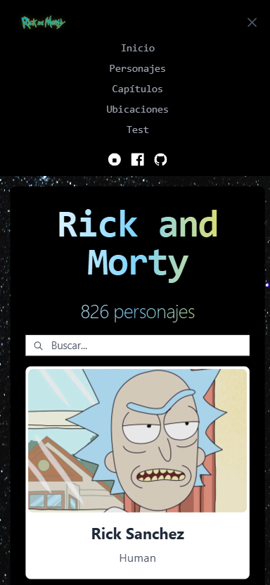
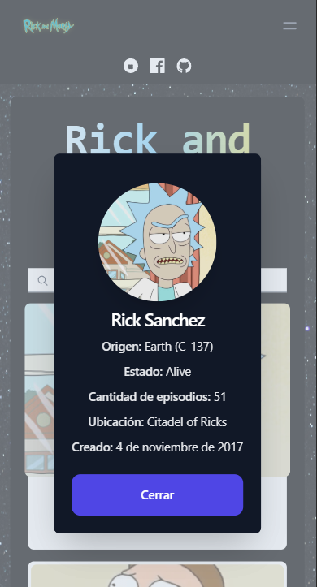
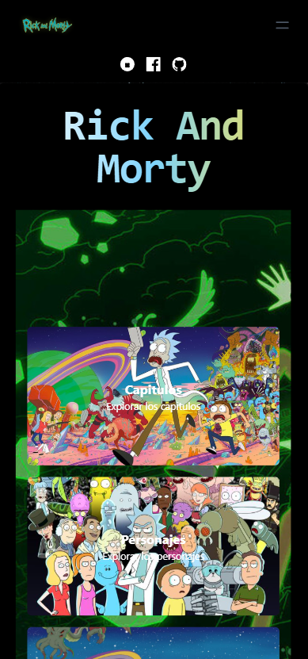

# Proyecto Rick y Morty usando React

¡Bienvenido al proyecto Rick y Morty! 🚀 Este es un proyecto desarrollado con React y Vite, utilizando Tailwind CSS para el diseño. La aplicación consume la API pública de Rick and Morty para mostrar información sobre personajes, ubicaciones y episodios de esta icónica serie. Además, la aplicación es completamente responsive, asegurando una experiencia óptima en dispositivos móviles, tabletas y computadoras de escritorio.

## Características


- Framework: Construido con React y Vite para una configuración rápida y eficiente.
- Diseño moderno: Utilizando Tailwind CSS para un diseño limpio y altamente personalizable.
- Datos en tiempo real: Consumo de la API pública de Rick and Morty para información actualizada.
- Responsive: Diseño adaptable para todo tipo de dispositivos.
- Componentes reutilizables: Código modular y fácil de mantener.
- Rendimiento optimizado: Aprovechando la configuración de Vite para tiempos de carga rápidos.


## Instalación y uso

Sigue estos pasos para ejecutar el proyecto localmente:

```bash
  npm install 
  npm run dev
```
    

## Capturas de pantalla


A continuación, puedes ver algunas vistas del proyecto en distintas vistas:












## Autor

Desarrollado por Alexis Diaz. 
Si tienes alguna pregunta, contáctame a través de mi correo : 
alexisshande1@gmail.com.
